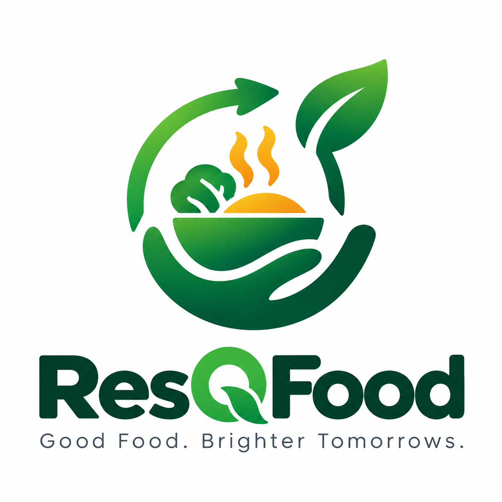

<div align="center">



# ResQFood

### *From Surplus to Smiles*

**An AI-powered food rescue coordination platform** connecting restaurants with NGOs and volunteer delivery riders to eliminate surplus food waste — in real time.

<br/>

[](https://react.dev)
[](https://typescriptlang.org)
[](https://vitejs.dev)
[](https://supabase.com)
[](https://tailwindcss.com)
[](https://leafletjs.com)
[](https://vercel.com)

<br/>

> 🌍 **1/3 of all food produced globally is wasted** while millions face hunger every day.  
> ResQFood bridges this gap with smart matching, live GPS delivery tracking, and real-time coordination.

</div>

---

## 📋 Table of Contents

- [Overview](#-overview)
- [Live Demo](#-live-demo)
- [Key Features](#-key-features)
- [How It Works](#-how-it-works)
- [Tech Stack](#-tech-stack)
- [Architecture](#-architecture)
- [Database Schema](#-database-schema)
- [Getting Started](#-getting-started)
- [Project Structure](#-project-structure)
- [Environment Variables](#-environment-variables)
- [Deployment](#-deployment-on-vercel)
- [Team](#-team)

---

## 🌟 Overview

ResQFood is a full-stack, production-ready web platform built by **Team Astra** for a national hackathon. It solves a real-world problem: thousands of kilograms of perfectly good food are discarded daily by restaurants and catering services, while food banks and shelters operate under capacity.

The platform creates a **three-sided real-time network**:

| Role | What they do |
|---|---|
| 🍽️ **Restaurants** | Post surplus food donations with pickup details, urgency levels, and dietary tags |
| 🏠 **NGOs / Shelters** | Browse, filter, and claim available donations; track live delivery progress |
| 🚴 **Volunteers** | Accept delivery assignments; share live GPS location; confirm pickups and handovers |

No phone calls. No WhatsApp groups. Just a clean, fast, real-time coordination layer that works.

---

## 🔗 Live Demo

> **Deployed:** [https://teamastrademo.vercel.app](https://teamastrademo.vercel.app) *(or your live Vercel URL)*

You can use the platform without signing up by clicking the **Public**, **Restaurant**, **NGO**, or **Volunteer** tabs in the navbar to preview each dashboard with pre-seeded demo data.

---

## ✨ Key Features

### 🔐 Authentication & Role-Based Access
- Full email/password signup and login via **Supabase Auth**
- Supported roles: `restaurant`, `ngo`, `volunteer`
- On registration, user profiles and role-specific records (`restaurants`, `ngos`) are auto-created in PostgreSQL
- Persistent JWT sessions — users stay logged in across page refreshes
- Password reset via email flow
- Auto-redirect to the correct dashboard on login based on verified role

### 🍽️ Restaurant Dashboard
- **Quick-post donation templates** — one click to prefill common food types (Biryani Trays, Sourdough Loaves, Salad Greens, etc.)
- Full form with: food name, category, quantity & unit, dietary tags (Vegan, Gluten-Free, Halal, etc.), pickup address, pickup instructions, urgency level (`low` → `critical`)
- **6 food categories**: Cooked Meals, Bakery & Bread, Fresh Produce, Dairy & Refrigerated, Packaged Goods, Beverages
- Real-time donation list with tabbed views: All / Available / In Dispatch / Completed
- Live delivery map embedded directly in the dashboard for active donations

### 🏠 NGO Dashboard
- Searchable, filterable live feed of available donations
- Filter by food category or free-text search
- **One-click claim** — atomic reservation with race condition protection (no two NGOs can claim the same donation)
- Tabbed views: Available / My Claimed / Completed History
- Live volunteer GPS tracking map for claimed donations in transit
- Toast feedback on every action

### 🚴 Volunteer Dashboard
- Browse all open delivery assignments (`reserved` donations awaiting a rider)
- Accept assignments with a single click
- **`ActiveRunCard` component** — an isolated sub-component per active delivery that:
  - Starts/stops live GPS tracking via browser `navigator.geolocation.watchPosition()`
  - Pushes location to Supabase `volunteer_locations` table every 5–10 seconds using Haversine-filtered deduplication (only pushes if moved > 10m)
  - Displays speed, accuracy, heading, and last-updated timestamp
  - Shows current coordinates on a live Leaflet map
- Step-by-step delivery flow: `reserved` → `volunteer_assigned` → `picked_up` → `on_the_way` → `delivered`
- GPS tracking auto-stops on delivery completion

### 🗺️ Live Delivery Map (`LiveDeliveryMap.tsx`)
- Built on **Leaflet** + **OpenStreetMap** (zero API key required)
- Renders volunteer position markers with heading & accuracy radius
- Updates in real time via **Supabase Realtime** WebSocket channel subscribed to `volunteer_locations`
- Accessible to both the NGO and the Volunteer during an active delivery

### 🎬 3D Scroll Animation (`ScrollFrameBackground.tsx`)
- **300 hand-exported PNG frames** rendered on a sticky `<canvas>` element
- Entirely scroll-controlled — the frame shown is a pure function of `scrollY`
- Zero `<video>` elements, zero autoplay, zero JavaScript animation loops
- Uses `requestAnimationFrame` only to decode and paint the current frame on scroll events
- Preloads all 300 frames on mount with a progress indicator
- Fully hardware-accelerated via canvas compositing

### 📊 Interactive Impact Calculator
- Slide to input your restaurant's weekly surplus meals
- Calculates in real time:
  - Annual CO₂ avoided (using UN FAO metric: 1.8 kg CO₂ per meal diverted)
  - Water saved in liters (850L per meal)
  - Families supported annually
- Based on peer-reviewed environmental science benchmarks

### 🔔 Real-Time Notifications
- Notification bell with animated unread badge counter
- Slide-in `NotificationDrawer` with type-specific icons
- Notification types: `donation_available`, `donation_accepted`, `volunteer_assigned`, `picked_up`, `delivered`, `cancelled`
- Mark individual or all notifications as read
- Persisted in Supabase `notifications` table

---

## ⚙️ How It Works

```
┌────────────────┐      Posts Donation       ┌──────────────────────────┐
│   Restaurant   │ ─────────────────────────▶│   Supabase Database       │
│   Dashboard    │                           │   (donations table)       │
└────────────────┘                           └──────────┬───────────────┘
                                                        │ Realtime broadcast
                                             ┌──────────▼───────────────┐
┌────────────────┐      Claims Donation      │     NGO Dashboard         │
│   NGO          │ ◀─────────────────────────│   (live donations feed)   │
│   Dashboard    │                           └──────────────────────────┘
└───────┬────────┘
        │ Requests volunteer
        ▼
┌────────────────┐    GPS → Supabase Realtime  ┌──────────────────────────┐
│   Volunteer    │ ──────────────────────────▶ │  volunteer_locations      │
│   Dashboard    │                             │  (live coordinates)       │
└────────────────┘                             └──────────┬───────────────┘
                                                          │ Realtime → NGO map
                                               ┌──────────▼───────────────┐
                                               │   LiveDeliveryMap         │
                                               │   (Leaflet + OSM)         │
                                               └──────────────────────────┘
```

**Donation Lifecycle:**
```
available → reserved → volunteer_assigned → picked_up → on_the_way → delivered → completed
```

---

## 🛠️ Tech Stack

### Frontend
| Technology | Version | Purpose |
|---|---|---|
| React | 19.2 | UI component framework |
| TypeScript | 6.0 | Type safety across the entire codebase |
| Vite | 8.3 | Build tool & dev server |
| Tailwind CSS | 4.3 | Utility-first styling |
| Lucide React | 1.49 | Icon library |
| Leaflet | 1.9.4 | Interactive maps |
| canvas-confetti | 1.9.4 | Celebration effects on donation completion |

### Backend (Supabase)
| Service | Usage |
|---|---|
| **Supabase Auth** | Email/password authentication, JWT session management, password reset |
| **Supabase PostgreSQL** | Primary database — profiles, restaurants, NGOs, donations, notifications |
| **Row Level Security** | Policy-based access control per user role |
| **Supabase Realtime** | WebSocket subscriptions for live donation updates and volunteer GPS |

### Browser APIs
| API | Usage |
|---|---|
| `navigator.geolocation.watchPosition()` | Continuous volunteer GPS tracking |
| `requestAnimationFrame` + `<canvas>` | 300-frame scroll animation rendering |
| `localStorage` | Offline-first location broadcast for immediate UI feedback |

---

## 🏗️ Architecture

```
src/
├── lib/                          # Core business logic
│   ├── supabase.ts               # Supabase client initialisation
│   ├── AuthContext.tsx           # React context: auth state, signIn, signUp, signOut,
│   │                             #   profile management, role-specific table sync
│   ├── donationStore.ts          # useDonationStore hook: CRUD for donations,
│   │                             #   Supabase Realtime subscriptions, notifications,
│   │                             #   localStorage fallback for demo mode
│   └── useVolunteerTracking.ts   # useVolunteerTracking hook: GPS watchPosition,
│                                 #   Haversine distance filter, Supabase upsert
│
├── components/
│   ├── Navbar.tsx                # 3-column navbar: logo | nav links | actions
│   ├── HeroSection.tsx           # Sticky 3D canvas + foreground CTA content
│   ├── ScrollFrameBackground.tsx # 300-frame canvas animation engine
│   ├── HowItWorks.tsx            # Animated step-by-step explainer section
│   ├── UserTypeCards.tsx         # Role feature cards (Restaurant / NGO / Volunteer)
│   ├── NGOMapPreview.tsx         # Static NGO cluster map preview
│   ├── ImpactSection.tsx         # CO₂ / water / families impact calculator
│   ├── PricingSection.tsx        # Pricing tier cards
│   ├── AboutSection.tsx          # Mission & team section
│   ├── Footer.tsx                # Links, policies, social
│   │
│   ├── RestaurantDashboard.tsx   # Full restaurant workspace (post, track, manage)
│   ├── NGODashboard.tsx          # Full NGO workspace (browse, claim, track)
│   ├── VolunteerDashboard.tsx    # Full volunteer workspace (accept, GPS, deliver)
│   ├── LiveDeliveryMap.tsx       # Leaflet map with real-time volunteer marker
│   │
│   ├── OnboardingModal.tsx       # Multi-step registration form (role-aware)
│   ├── SignInModal.tsx           # Login form with error handling
│   ├── ProfileModal.tsx          # Edit profile, address, vehicle type
│   ├── NotificationDrawer.tsx    # Slide-in notification panel
│   ├── DemoModal.tsx             # Demo walkthrough modal
│   └── PolicyModal.tsx           # Privacy / Terms modal
│
└── types/
    └── index.ts                  # Shared TypeScript types (UserRole, DonationItem, etc.)
```

---

## 🗄️ Database Schema

All tables live in the `public` schema with **Row Level Security enabled**.

```sql
profiles              -- Linked 1:1 with auth.users; stores role, name, org, phone, city
restaurants           -- Restaurant metadata; linked to profiles via profile_id
ngos                  -- NGO metadata; linked to profiles via profile_id
donations             -- Core donation records with full lifecycle status tracking
donation_responses    -- NGO claim records (which NGO claimed which donation)
volunteer_assignments -- Delivery task assignments linking volunteer ↔ donation
volunteer_locations   -- Live GPS coordinates pushed by the tracking hook (Realtime-enabled)
notifications         -- In-app notification records per user (recipient_id)
```

### Donation Status Flow

| Status | Meaning |
|---|---|
| `available` | Posted by restaurant, visible to all NGOs |
| `reserved` | Claimed by an NGO, awaiting volunteer |
| `volunteer_assigned` | Volunteer accepted the delivery |
| `picked_up` | Volunteer confirmed food collected from restaurant |
| `on_the_way` | En-route to NGO, GPS active |
| `delivered` | Food handed over to NGO |
| `completed` | Fully archived |
| `cancelled` | Withdrawn by restaurant |

### RLS Policy Summary

| Table | SELECT | INSERT | UPDATE |
|---|---|---|---|
| `profiles` | Public | Own row only | Own row only |
| `restaurants` | Public | Owner | Owner |
| `ngos` | Public | Owner | Owner |
| `donations` | Authenticated + creator | Creator | Creator |
| `volunteer_locations` | Public | Volunteer | Volunteer |
| `notifications` | Recipient only | System | Recipient |

---

## 🚀 Getting Started

### Prerequisites
- **Node.js** 18 or higher
- **npm** 9+
- A **[Supabase](https://supabase.com)** account (free tier works perfectly)

### 1. Clone the repository
```bash
git clone https://github.com/samyak4628/teamastrademo.git
cd teamastrademo
```

### 2. Install dependencies
```bash
npm install
```

### 3. Configure environment variables
```bash
cp .env.example .env
```
Edit `.env`:
```env
VITE_SUPABASE_URL=https://your-project-ref.supabase.co
VITE_SUPABASE_ANON_KEY=your-anon-key
```

### 4. Apply database migrations
Open the [Supabase SQL Editor](https://supabase.com/dashboard/project/_/sql/new) and run the following files **in order**:

```
supabase/migrations/20261001_initial_schema.sql
supabase/migrations/20261001_auth_profile_fixes.sql
supabase/migrations/20261001_database_integration_complete.sql
supabase/migrations/20261001_volunteer_locations.sql
```

Each file is idempotent — safe to re-run. They use `CREATE TABLE IF NOT EXISTS` and `DROP POLICY IF EXISTS` guards.

### 5. Disable email confirmation (development)
In Supabase Dashboard → **Authentication → Providers → Email** → toggle off **"Confirm email"**.

> This allows instant sign-in without waiting for a verification email. For production, configure a custom SMTP provider under Auth → SMTP Settings.

### 6. Start the dev server
```bash
npm run dev
```

Open **[http://localhost:5173](http://localhost:5173)** 🎉

---

## 📁 Project Structure

```
teamastrademo/
├── public/
│   ├── assets/
│   │   ├── resqfood-logo.png
│   │   ├── logo.png
│   │   └── hero-food-rescue.mp4
│   ├── frames/                  # 300 PNG frames (ezgif-frame-001.png → 300.png)
│   └── favicon.svg
│
├── src/
│   ├── App.tsx                  # Root: modal state, workspace routing, toast system
│   ├── main.tsx                 # ReactDOM entry point
│   ├── index.css                # Global styles + Tailwind base
│   ├── App.css                  # App-level keyframe animations
│   ├── components/              # (see Architecture section above)
│   ├── lib/                     # (see Architecture section above)
│   └── types/index.ts
│
├── supabase/
│   └── migrations/
│       ├── 20261001_initial_schema.sql
│       ├── 20261001_auth_profile_fixes.sql
│       ├── 20261001_database_integration_complete.sql
│       └── 20261001_volunteer_locations.sql
│
├── .env.example                 # Template for environment variables
├── .gitignore                   # Excludes .env, node_modules, dist
├── package.json
├── vite.config.ts
├── tailwind.config.js
├── tsconfig.json
└── README.md
```

---

## 🔐 Environment Variables

| Variable | Description | Example |
|---|---|---|
| `VITE_SUPABASE_URL` | Your Supabase project URL | `https://xxxx.supabase.co` |
| `VITE_SUPABASE_ANON_KEY` | Your Supabase anonymous (public) key | `eyJhbGci...` |

> ⚠️ **Never commit `.env` to version control.** It is already listed in `.gitignore`. Use `.env.example` as the shareable template.

---

## 🌐 Deployment on Vercel

| Setting | Value |
|---|---|
| **Framework Preset** | Vite (auto-detected) |
| **Root Directory** | ` ` *(repo root — leave blank)* |
| **Build Command** | `npm run build` |
| **Output Directory** | `dist` |
| **Install Command** | `npm install` |

**Steps:**
1. Go to [vercel.com/new](https://vercel.com/new) → import `samyak4628/teamastrademo`
2. Vercel auto-detects Vite
3. Under **Environment Variables**, add:
   - `VITE_SUPABASE_URL`
   - `VITE_SUPABASE_ANON_KEY`
4. Click **Deploy** 🚀

---

## 👥 Team

**Team Astra** — Hackathon 2026

| Name | Role |
|---|---|
| **Samyak Pravin Dhainje** | Full-Stack Developer & Team Lead |

---

## 📄 License

Built for hackathon demonstration purposes. All rights reserved by Team Astra.

---

<div align="center">

**ResQFood** — Making every surplus meal count.

*Built with ❤️ to fight food waste, one delivery at a time.*

</div>
